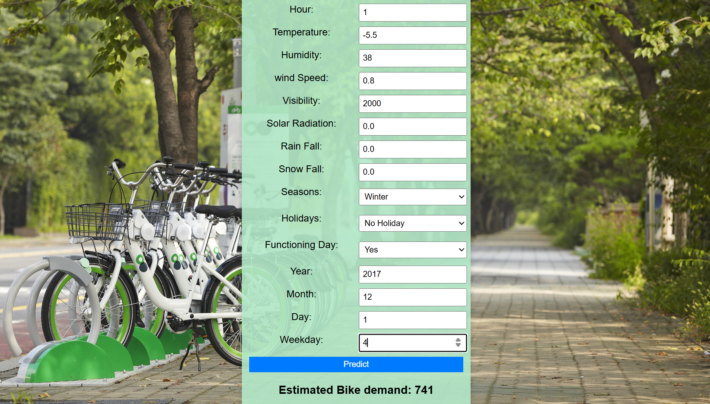

## 🚲 Seoul Bike Sharing Demand Prediction

This project is a Machine Learning web application built using Flask that predicts bike rental demand in Seoul based on weather conditions, seasonal information, and calendar features.

The model was trained using scikit-learn with preprocessing handled through a Pipeline and ColumnTransformer (including scaling and One-Hot Encoding).

The trained model is deployed through a Flask web interface where users can input feature values and receive real-time predictions.

## 🧠 Features Used

Hour

Temperature

Humidity

Wind Speed

Visibility

Solar Radiation

Rainfall

Snowfall

Seasons

Holiday

Functioning Day

Year, Month, Day, Weekday

## 🛠 Tech Stack

Python

Flask

Pandas

NumPy

Scikit-learn

HTML / CSS

## 🚀 How to Run Locally

Clone the repository

Install dependencies:

pip install -r requirements.txt

Run the application:

python app.py

Open your browser:

http://127.0.0.1:5000
## 📌 Project Highlights

End-to-end ML pipeline

Categorical feature handling using OneHotEncoder

Clean Flask-based web interface

Deployment-ready structure

## 🌐 Live Demo

https://seoul-bike-sharing-flask-app.onrender.com

## 📸 Application Preview

